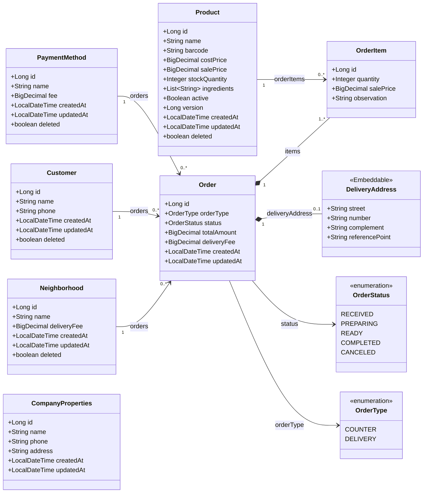

git add README.md docs/
git status# trivia

Sistema de venda para uma hamburgueria, atendendo balcão e delivery (com taxa de entrega por bairro). Reescrita de um projeto anterior, focada em boas práticas de Spring Boot: DTOs em Records, Lombok, Soft Delete e controle de concorrência.

Sem autenticação nesta fase — o domínio foi desenhado para permitir adicioná-la depois sem redesenhar o núcleo do sistema.

Stack
Java 21
Spring Boot 4.1 (Jakarta EE 11 / Hibernate 7)
Spring Data JPA
Bean Validation
Lombok
H2 Database (desenvolvimento)
Maven
Status

🚧 Em desenvolvimento. Camadas concluídas até o momento:

 Entidades (Product, Customer, PaymentMethod, Order, OrderItem, CompanyProperties, Neighborhood)
 Repositories
 DTOs (Records)
 Services (ProductService, CustomerService, PaymentMethodService, NeighborhoodService, OrderService)
 Controllers (ProductController, PaymentMethodController, NeighborhoodController, OrderController)
 Tratamento global de exceções (GlobalExceptionHandler)
 Documentação da API (Swagger/OpenAPI)

Pendências conhecidas:

 Service/Controller de CompanyProperties (consulta e atualização dos dados da empresa)
 Estorno de estoque no cancelamento de pedido — decisão de negócio já identificada, ainda não implementada
 Listagem de pedidos com filtro por período
 Relatórios de vendas
 Testes automatizados

Especificação completa de requisitos em docs/REQUISITOS.md

## Modelo de domínio

## Como rodar

_Em breve — assim que a camada de Controllers estiver pronta._
