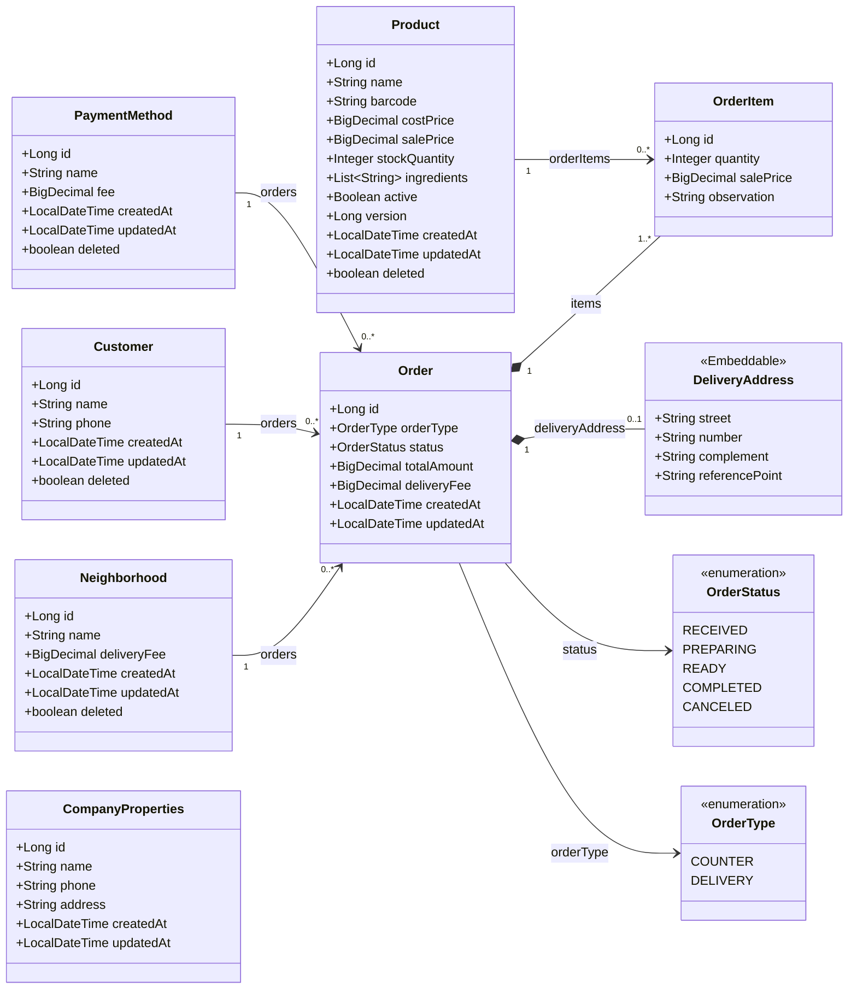

# trivia — Especificação de Requisitos (v7 — balcão + delivery por bairro)

Sistema de venda para uma hamburgueria, atendendo **dois tipos de venda**:
retirada no balcão (`COUNTER`) e entrega (`DELIVERY`). Um atendente recebe o
pedido, monta a venda a partir do cardápio, identifica o cliente (nome e
telefone, sempre) e, se for entrega, registra o endereço completo — incluindo
o **bairro**, que determina a taxa de entrega. Escolhe a forma de pagamento e
finaliza; o sistema calcula o total (itens + taxa de entrega) e baixa o
estoque.

Mudanças em relação à v6: **`OrderType` (`COUNTER`/`DELIVERY`) volta a
existir** — a retirada no balcão foi reintroduzida. A taxa de entrega deixou de
ser um valor único de empresa (`CompanyProperties.defaultDeliveryFee`, que
sai) e passou a ser **por bairro**, numa entidade nova (`Neighborhood`),
inspirada em sistemas reais do setor (Contatei/Anota Ai). O endereço de
entrega (bairro, rua, número, complemento, ponto de referência) deixou de
pertencer ao `Customer` e passou a pertencer ao **`Order`** — o mesmo cliente
pode pedir para endereços diferentes em pedidos diferentes. `Customer` ficou
mais enxuto: só nome e telefone.

Mantidas as demais decisões: **sem autenticação** (JWT/OAuth2 fora do
escopo, domínio pronto para adicionar depois sem redesenho), DTOs de
_request_/_response_ separados (records), entidades com Lombok, exclusão
lógica (soft delete) e concorrência no estoque.

---

## 1. Ator

- **Atendente.** Ator único. **Nesta versão não há autenticação** — todos os
  endpoints são abertos. O sistema deve ser estruturado para que a
  autenticação possa ser adicionada depois **sem refazer o domínio** (a venda
  não depende de um usuário logado).

---

## 2. A "tela única" (escopo de UI)

A tela principal é o **atendimento do pedido**: identificação do cliente
(nome, telefone) + seletor de tipo de venda (balcão/entrega) + cardápio para
montar os itens + seletor de forma de pagamento. Se a venda for entrega,
campos adicionais aparecem: bairro (lista pré-cadastrada, sem valor de taxa
visível ao atendente/cliente nessa lista) + rua + número + complemento + ponto
de referência. O atendente registra tudo, vê o total correndo (já com a taxa
de entrega somada, quando houver) e finaliza a venda. Gestão de produtos/
formas de pagamento/bairros/empresa são **endpoints de apoio**. **Não há tela
de login.**

---

## 3. Requisitos Funcionais

### Pedido / Venda (fluxo principal)
- **RF01** — Listar produtos disponíveis (cardápio) para montar a venda.
- **RF02** — Listar formas de pagamento disponíveis.
- **RF03** — Registrar uma venda com um ou mais itens, informando o tipo de
  venda (`COUNTER`/`DELIVERY`), nome e telefone do cliente (sempre), e — só se
  `DELIVERY` — bairro, rua, número, complemento e ponto de referência. O
  sistema calcula o total (itens + taxa de entrega) e baixa o estoque.
- **RF04** — Buscar uma venda por id (detalhe / reimpressão).
- **RF05** — Listar vendas de forma paginada, com filtro por período.
- **RF06** — Atualizar o status da venda (fluxo de preparo/entrega).
- **RF07** — Cancelar uma venda (status `CANCELED`).

### Produtos (cadastro — apoio)
- **RF08** — Cadastrar produto.
- **RF09** — Atualizar produto.
- **RF10** — Buscar produto por id.
- **RF11** — Excluir produto (exclusão **lógica**).

### Formas de pagamento (cadastro — apoio)
- **RF12** — CRUD de formas de pagamento (cadastrar, listar, atualizar, excluir
  **lógico**).

### Clientes (apoio — sem login)
- **RF13** — Ao registrar uma venda, criar (ou reaproveitar, via dedup por
  telefone) o `Customer` com nome e telefone informados na própria requisição.
  Não há tela de cadastro de cliente separada nesta fase.

### Bairros (cadastro — apoio)
- **RF14** — Listar bairros atendidos (para o seletor da tela de venda — sem
  expor a taxa de entrega nessa listagem pública, se o front-end optar por
  ocultar).
- **RF15** — CRUD de bairros (cadastrar, atualizar, excluir **lógico**),
  incluindo o valor da taxa de entrega. Ação de administrador — sem controle
  de autorização real nesta fase.

### Configuração da empresa (apoio)
- **RF16** — Consultar os dados da empresa (nome, telefone, endereço).
- **RF17** — Atualizar os dados da empresa. Conceitualmente uma ação de
  administrador — sem controle de autorização real nesta fase.

### Relatórios
- **RF18** — Relatório de vendas por produto em um período.
- **RF19** _(opcional)_ — Total de vendas por dia e/ou por forma de pagamento.

> Continuam fora do escopo: login/emissão de token, usuários, papéis, senha.
> `Customer` **não** é uma conta — é só nome e telefone, criado a partir do
> próprio pedido.

---

## 4. Regras de Negócio

- **RN01 — Estoque suficiente.** Um item só é aceito se
  `estoque ≥ quantidade solicitada`; caso contrário a venda inteira é rejeitada.

- **RN02 — Baixa de estoque concorrente.** A baixa deve ser segura sob
  concorrência: duas vendas simultâneas do mesmo produto não podem levar o
  estoque abaixo de zero. Implementar via **bloqueio otimista** (campo
  `version`) com repetição em conflito, ou via **UPDATE atômico condicional**.
  _(Alvo do módulo de concorrência. Justificativa: múltiplos atendentes podem
  registrar pedidos simultâneos disputando o mesmo produto em estoque.)_

- **RN03 — Total da venda.** `totalAmount` = soma de `(preço de venda ×
  quantidade)` de cada item **mais** `deliveryFee` — valor final, pronto para
  cobrança. Em `COUNTER`, `deliveryFee` é sempre `zero`. Em `DELIVERY`,
  `deliveryFee` é o snapshot da taxa do bairro escolhido (RN11). O preço de
  cada item é congelado no próprio item no ato da venda (**snapshot**), nunca
  lido dinamicamente do produto depois.

- **RN04 — Exclusão lógica.** Produtos, formas de pagamento, clientes e
  bairros nunca são removidos fisicamente; são marcados como excluídos e
  somem das consultas padrão, preservando a integridade do histórico de
  vendas.

- **RN05 — Venda é imutável.** Vendas não são excluídas; "cancelar" é a
  transição de status `CANCELED`, não um _delete_.

- **RN06 — Ciclo de vida do status.** Fluxo:
  `RECEIVED → PREPARING → READY → COMPLETED`, com `CANCELED` como saída
  possível. Transições inválidas devem ser rejeitadas. `READY` significa
  "pronto para retirada" (`COUNTER`) ou "pronto para saída de entrega"
  (`DELIVERY`), dependendo do tipo; `COMPLETED` é a entrega/retirada
  concluída.

- **RN07 — Estorno de estoque no cancelamento.** Definir se cancelar uma venda
  devolve o estoque dos itens.
  _(Recomendação: devolver o estoque se a venda ainda não estiver
  `COMPLETED`. Sua decisão.)_

- **RN08 — Disponibilidade × exclusão.** `active` indica **disponibilidade no
  cardápio**; é conceito **distinto** de `deleted` (exclusão lógica). Não
  confundir.

- **RN09 — Tipo da venda governa a obrigatoriedade do endereço.** Todo `Order`
  tem um `OrderType` (`COUNTER`/`DELIVERY`). É esse campo — não a presença de
  dados de endereço — que determina a regra a seguir: o bloco de entrega
  (bairro, rua, número, complemento, ponto de referência) é obrigatório
  quando `orderType = DELIVERY` e ausente quando `COUNTER`. `Customer`
  (nome + telefone) é obrigatório **em ambos os casos**, sem exceção.
  _(Resolvido com o mesmo padrão já usado na v4: o bloco de entrega é um
  objeto aninhado **opcional** no `OrderRequest` — `null` em `COUNTER`,
  obrigatório em `DELIVERY`. A **presença** do objeto quando `DELIVERY` ainda
  precisa de checagem explícita no service — `@NotNull`/`@Valid` num campo
  nulo não descem para validar nada.)_

- **RN10 — Deduplicação de cliente por telefone.** Antes de criar um
  `Customer`, o service busca por `phone`; se já existir um cliente ativo com
  esse telefone, reaproveita o cadastro (atualizando o nome se vier
  diferente); caso contrário, cria um novo. `phone` é a chave de negócio de
  `Customer` — usada tanto no `equals`/`hashCode` da entidade quanto nessa
  busca do service. Aplica-se a **toda** venda, `COUNTER` ou `DELIVERY`.
  _(Ponto de atenção para a entidade: **não** force `unique = true` na coluna
  `phone` a nível de banco — combinado com soft delete, bloquearia reaproveitar
  um telefone que pertenceu a um `Customer` já excluído logicamente. A dedup é
  responsabilidade do service, não do schema.)_

- **RN11 — Taxa de entrega é congelada no pedido, por bairro.**
  `Order.deliveryFee` é um **snapshot**, copiado de `Neighborhood.deliveryFee`
  (do bairro escolhido) no momento em que a venda `DELIVERY` é criada — nunca
  lido dinamicamente depois. Mesmo princípio já aplicado ao `salePrice`
  (RN03): se o valor do bairro mudar amanhã, pedidos já feitos não são
  afetados. Consequência: `deliveryFee` **não** é campo de entrada direto no
  `OrderRequest` — é o service quem lê o valor vigente do bairro e grava;
  mesma fronteira de confiança já aplicada a `salePrice`/`totalAmount`. Em
  `COUNTER`, não há bairro, e `deliveryFee` é gravado como `zero`.

- **RN12 — `deliveryFee` de bairro aceita zero.** Entrega grátis num bairro
  específico (próximo à loja, promoção) é um valor legítimo — validado com
  `@PositiveOrZero`, não `@Positive`, no `NeighborhoodRequestDTO`.

---

## 5. Requisitos Não-Funcionais / Decisões Técnicas

- **RNF01** — Java 21, Spring Boot 4.1.x (Jakarta EE 11 / Hibernate 7), Maven.
- **RNF02** — Arquitetura em camadas: `controller → service → repository`,
  domínio isolado das camadas web e de persistência.
- **RNF03** — **DTOs separados por direção**: um record de _request_ e um de
  _response_ por recurso. Entidade nunca exposta diretamente na API.
- **RNF04** — DTOs como **Java Records** (imutáveis). Entidades JPA como
  classes com **Lombok granular** — evitar `@Data` em entidade; cuidar de
  `equals`/`hashCode`/`toString` com relacionamentos.
- **RNF05** — **Soft delete** em `Product`, `PaymentMethod`, `Customer` e
  `Neighborhood`, com filtro automático nas consultas.
- **RNF06** — **Concorrência** no estoque (bloqueio otimista com `version`
  e/ou UPDATE atômico).
- **RNF07** — **Injeção por construtor** (não por campo).
- **RNF08** — Bean Validation nos records de _request_. `@PositiveOrZero` vs
  `@Positive` decidido campo a campo — ex.: `stockQuantity`, `fee` e
  `Neighborhood.deliveryFee` aceitam zero; `costPrice`/`salePrice` não.
  **Toda** constraint numérica de campo obrigatório vem acompanhada de
  `@NotNull` — `@Positive`/`@PositiveOrZero` sozinhas tratam `null` como
  válido.
- **RNF09** — **Sem autenticação nesta versão** (Spring Security / OAuth2 /
  JWT removidos). Estruturar para permitir adicionar depois sem refazer o
  domínio.
- **RNF10** — Tratamento global de exceções com `@RestControllerAdvice`,
  incluindo erros de concorrência (ex.: `OptimisticLockException`) e status
  HTTP consistentes. Decisão: `jakarta.persistence.EntityNotFoundException` é
  a exceção padrão de "recurso não encontrado" em todos os services —
  mapeada para `404` num único `@ExceptionHandler`. Ciente de que essa
  exceção, na especificação JPA, tem outro propósito original — reuso
  deliberado como convenção do projeto, não engano.
- **RNF11** — Paginação nas listagens.
- **RNF12** — Documentação com OpenAPI/Swagger.
- **RNF13** — Testes automatizados (service e camada web) cobrindo, no
  mínimo, RN01–RN03 e a validação condicional do bloco de entrega (RN09).
- **RNF14** — `application.properties` em **UTF-8**.
- **RNF15** — Seed inicial (`DatabaseSeeder`) de produtos, formas de
  pagamento, bairros e o registro único de `CompanyProperties`, para a tela
  já abrir com dados.

---

## 6. DTOs por recurso (request / response)

Records. Campos _read-only_ (id, timestamps, valores calculados) só aparecem
no _response_.

**Produto**
- `ProductRequestDTO`: name, barcode, costPrice, salePrice, stockQuantity, ingredients, active
- `ProductResponseDTO`: id, name, barcode, costPrice, salePrice, stockQuantity, ingredients, active, createdAt, updatedAt

**Forma de pagamento**
- `PaymentMethodRequestDTO`: name, fee
- `PaymentMethodResponseDTO`: id, name, fee

**Cliente**
- `CustomerRequestDTO`: name, phone — **ambos obrigatórios, sempre** (`COUNTER`
  ou `DELIVERY`). Não é cadastro independente — nasce junto da venda.
- `CustomerResponseDTO`: id, name, phone

**Bairro**
- `NeighborhoodRequestDTO`: name (`@NotBlank`), deliveryFee (`@NotNull
  @PositiveOrZero`)
- `NeighborhoodResponseDTO`: id, name, deliveryFee

**Configuração da empresa**
- `CompanyPropertiesRequestDTO`: name, phone, address
- `CompanyPropertiesResponseDTO`: id, name, phone, address, createdAt, updatedAt

**Endereço de entrega** _(aninhado no pedido, não é recurso próprio)_
- `DeliveryAddressRequestDTO`: neighborhoodId (`@NotNull`), street (`@NotBlank`),
  number (`@NotBlank`), complement _(opcional)_, referencePoint _(opcional)_
- `DeliveryAddressResponseDTO`: neighborhoodName, street, number, complement,
  referencePoint

**Venda**
- `OrderRequestDTO`: orderType (`@NotNull`), paymentMethodId (`@NotNull`),
  customer (`CustomerRequestDTO`, `@NotNull @Valid` — sempre obrigatório),
  delivery (`DeliveryAddressRequestDTO`, **opcional** — `null` em `COUNTER`,
  obrigatório em `DELIVERY`; checagem de presença é do service, RN09), items[]
  (`@Valid @NotEmpty`). **Sem** `deliveryFee` — vem do service (RN11).
- `OrderItemRequestDTO`: productId, quantity, observation
- `OrderResponseDTO`: id, orderType, customer (`CustomerResponseDTO`), delivery
  (`DeliveryAddressResponseDTO`, `null` se `COUNTER`), deliveryFee, totalAmount
  (**já inclui** `deliveryFee`, RN03), status, paymentMethodName, items[]
- `OrderItemResponseDTO`: id, productName, quantity, salePrice, observation
- `OrderStatusRequestDTO`: status  _(para RF06)_

**Relatório**
- `ProductSalesResponseDTO`: productId, name, totalQuantity, totalValue

---

## 7. Modelo de domínio (diagrama de classes)

### Notas do modelo
- Entidades **removidas** com a autenticação: `User`, `Role`, `AccessProfile` e
  a interface `UserDetails`. `Customer` continua como registro simples de
  contato — **sem** relação com `User`/login. Um `Customer` não autentica
  nada.
- `deleted` (soft delete) em `Product`, `PaymentMethod`, `Customer` e
  `Neighborhood` (RN04). `Order` **não** tem — cancelamento é status.
  `CompanyProperties` também **não** tem — registro único, sempre existente.
- `version` só em `Product` — recurso disputado na baixa de estoque (RN02).
- `salePrice` em `OrderItem` é o **snapshot** do preço no ato da venda (RN03).
  `Order.deliveryFee` segue o mesmo princípio (RN11), copiado de
  `Neighborhood.deliveryFee` quando `DELIVERY`, ou `zero` quando `COUNTER`.
- `active` (disponibilidade) e `deleted` (exclusão) coexistem em `Product` de
  propósito (RN08).
- **`OrderType` voltou** (v7) — governa a obrigatoriedade do bloco de
  entrega, não a presença/ausência de `customer` (que agora é sempre
  obrigatório, `COUNTER` ou `DELIVERY`).
- **Endereço de entrega mudou de dono:** até a v6, seria natural ele morar em
  `Customer`; a partir da v7, mora no **`Order`** — porque o bairro (e,
  consequentemente, o endereço completo) pode variar entre pedidos do mesmo
  cliente. `Customer` ficou reduzido a `name`/`phone`.
- **`DeliveryAddress` é `@Embeddable`, não entidade.** Rua, número,
  complemento e ponto de referência não têm identidade nem tabela própria —
  são um grupo de colunas embutido diretamente em `order_tb`. Diferente de
  `Neighborhood`, que é uma entidade de verdade (`@ManyToOne`), com sua
  própria tabela e ciclo de vida (cadastro, soft delete).
- `CompanyProperties` perdeu `defaultDeliveryFee` (v7) — substituído por
  completo pela taxa por bairro (`Neighborhood.deliveryFee`). Mantém `name`,
  `phone`, `address` como dados institucionais da própria empresa.

### Relacionamentos que sobraram para praticar
Com a remoção da autenticação, saiu do modelo o **ManyToMany** (`User`↔`Role`).
`Neighborhood`↔`Order` entra como mais um **ManyToOne/OneToMany**, junto de
`Customer`↔`Order`, `Order`↔`OrderItem`, `Product`↔`OrderItem` e
`PaymentMethod`↔`Order`. `DeliveryAddress` estreia o **`@Embeddable`**, e o
**ElementCollection** (`Product.ingredients`) segue igual.

> **Gancho opcional** — se quiser continuar praticando **ManyToMany** sem trazer
> a autenticação de volta: transforme `ingredients` de `List<String>`
> (ElementCollection) numa entidade `Ingredient`, ligada a `Product` por
> ManyToMany. Fica a seu critério — não está no escopo base.
